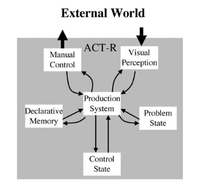
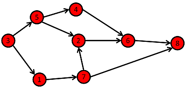

Creating a Production System in Bend and Also It's Neuromorphic
===============================================================

.. role:: strike
   :class: strike

*note: this article is unfinished, I am uploading it to make sure I've got my syntax all right.*

There comes a time, in every young woman's life, when she sees something interesting, and thinks to herself

    I should make that ACT-R!

this is almost always a terrible idea. Too many things are already ACT-R, including yet a fourth or fifth (at time of writing) upcoming Python implementation of ACT-R, and almost none of them are any help to Dan, who is very sick of toiling alone.

However, since I am wont to terrible ideas, and I've been duly instructed by Frank Ritter not to get involved in maintaining ACT-R, how about we do it anyway?

What follows is a tutorial on and some motivation for `bactr <https://github.com/eilene-ftf/bactr>`_ (which probably should have been called bend-r but here we are, maybe I'll rename it eventually), part of our project at `CNEW 2026 <https://canadianneuromorphicengineeringworkshop.github.io/>`_. It occurs that there are very few tutorials on Bend programming language out there, and almost none of them are usable since it's an unfinished project and the syntax is unstable. It also occurs that there are no tutorials at all on this somewhat ridiculous project of making neuromorphic computers interpret conventional programs (for a certain value of conventional). It is also beginning to look like ACT-R is becoming forgotten technology, whilst so-called "agent harnesses" are all the rage. Thus, some explanation and motivation will also be given for production systems proper as instruments of analysis in artificial intelligence research. Hopefully, the reader will find it adequate.

The code here was written for bend 0.2.38.

None of this could have been done without the hard work of:

- Esra Hancock
- Maria Vorobeva
- Stef Kwok
- Theo Pana
- Ruth Nobossi
- Isaac Liu
- Connor Hanley
- Spencer Eckler
- Tim Gothard
- Eilene Tomkins-Flanagan (that's me!)
- and the support of Michael Furlong and our dear :strike:`leader` supervisor Mary Kelly

I'll precede the article by structuring it a little bit, because it's throwing together some ideas that are individually complicated, and may seem to go together about as well as oreos and green beans (that is, if you're not a sicko). At base, we are interested in *neuromorphic computing*, a sort of computer architecture where the units of computation are, rather than transistors, neuron-like in some important respects (typically, they have some capacitance and they like to violently discharge on reaching a threshold). The fundamental question is: can we coax these units into a shape that is programmable in the way a conventional computer is? Secondarily, can we use them to effect real-time control of a robot with conventional programs? The answer to both is yes, but the approach is layered, as neuromorphic computing addresses the elements of *computer hardware*, and we need to arrange them into a *computer architecture* with an instruction set that can serve as the compile target for *software*, which has to run a program that *effects control*. The tutorial will work top-down, in part because the computer architecture is unfinished. Control will be effected using a *production system*, which is to be implemented in the *bend programming language*. Bend compiles to a format called *HVM*, a model of graph computing that can relatively clearly be translated to a *neuromorphic architecture* with a little help from our old friends, VSAs. 

Production Systems
------------------

    A production system is a scheme for specifying an information processing system. It consists of a set of productions, each production consisting of a condition and an action. It also has a collection of data structures: expressions that encode the information upon which the production system works--on which the actions operate and on which the conditions can be determined to be true or false. :cite:`Newell1973`

Put in a slightly less tortured way, Newell writes that a production system has two main elements:

- some data structures that may change dependently on input (typically asynchronously)
- a set of condition-action pairs such that:

  - the conditions are sensitive to the values of the data structures
  - the actions may update the data structures
  - whenever a condition is true (with some complications), its corresponding action is taken

Put more cutely (and in a more modern vocabulary), production systems are a model of `event-driven computing <https://en.wikipedia.org/wiki/Event-driven_programming>`_. In each production system, there is a loop that runs continually, and at each iteration, tests if any condition in the set of condition-action pairs is true. If it detects that one is true, then it takes the appropriate action. In case more than one is true, the designer specifies some method of conflict resolution to determine which action or actions will be taken. In our example, the conflict resolution method will be random choice.

Newell intended his production systems to form the basis of models of human cognition, in particular representing the human as a *behaving system*. A production system never freezes; it interacts with its data structures to the beat of an infinite loop, and its inputs can be modified at any time, independently of its operation. Likewise, it can modify its data structures, and accordingly a process monitoring their values can be independently altered. If the data structures are being monitored by a simulated mouse or keyboard, or a robotic arm, the production system is generating control signals for them. If its inputs are provided by sensors streaming data in real time, the production system is able to behave in real time, dependently on its inputs. A production system, therefore, generates behaviour *by default*, which makes it somewhat different from other paradigms of cognitive modelling. Usually, cognitive modelling is interested in predicting behaviour rather than generating that behaviour. These two approaches are methodologically distinct in a way that is worth discussing.

In the former case, we tend to get a distribution of behaviours sensitive to some experimental conditions, and (depending on how our models are set up) it can be difficult to reproduce the behaviour of our subjects, as just sampling the conditional probability distribution does not necessarily reflect individual processing. Our model might average across individuals or accidentally make two subgroups dependent on some relevant causal factor appear to be the same group, even if it is predictive. On the other hand, we have the second case, in which behaviour is generated. Here, we can always create a population of synthetic subjects, with some parameters that vary between subjects, and use the distribution of their behaviour as a predictive model of human behaviour. This is not to say that the latter technique is strictly superior (it is always possible to do sufficiently careful predictive statistics that individual behaviour can be reconstructed), but the latter method shifts one's frame to considering not just an underlying cognitive process (which we should always be concerned with, whether or not we are doing predictive or generative modelling), but how it plays out in real time, and how it influences decision and ultimately individual behaviour.


   
    An illustration of the ACT-R architecture, from :cite:`Anderson2007` (p. 20)

A production system is one of the two basic components of ACT-R :cite:`Anderson2007` (p. 40), the other being a "declarative" (in more psychological terms, "explicit") memory system. The declarative memory (by convention) makes no distinction between semantic and episodic memory (although some declarative memories may), and permits cued retrieval. That is, memories are stored associatively in cue-trace pairs, and if the memory system is probed with the appropriate cue, a corresponding trace is retrieved. As suggested in the title, we'll be focusing on *just* the production system, but ACT-R does something important that we will have to pause on. Namely, its data structures share a uniform format. All data consists of a collection of slot-value pairs (referred to as a "chunk") that are made available to the production system through elements of working memory called "buffers". The declarative memory system stores associations between chunks, and the production system is sensitive to the chunks presently stored in working memory. Chunks are also the data exchanged between the production systems and its inputs and outputs more generally.

A useful intuition is that the slots and values in a memory trace are like bound elements of semantic information. If I wanted to store that there is a red door in an ACT-R system's field of view, I might store 

```
door:red
```

in a buffer, where "door" is the slot and "red" is the value. One can also think of slot-value pairs like the key-value pairs in a dictionary/hashtable, and that's the exact intuition we'll be using to implement bactr.

Because of the uniform format, and because ACT-R models are quite simple and inherently capable of effecting behaviour, bactr will be a general-purpose production system written in Bend, using the ACT-R slot-value format, and control programs will be formatted as sets of productions.

Doing it In Bend
----------------

`Bend <https://github.com/HigherOrderCO/bend>`_ is a programming language invented by an Avatar fanboy and named accordingly. It is a functional language that superficially resembles Python while working nothing at all like Python. It is weakly typed, except that the interpreter almost always enforces strong typing. It might or might not be abandonware, having not recieved any updates since last year at time of writing. It is also very interesting, because it compiles to `HVM <https://github.com/HigherOrderCO/HVM2>`_.

HVM stands for "Higher-order Virtual Machine", and it's a virtual machine in the way that the Java virtual machine is. That is to say, it is a model computer with its own machine language you can compile programs into. The model computer is simulated by a piece of software on a variety of host platforms, and, in principle, programs compiled to its machine language should run identically on any platform, so long as they are running the same version of HVM.

What makes HVM particularly interesting is that its machine language is based on a model of computation called interaction combinators :cite:`Lafont1997`. For now, the exact details can be glossed over, but there are some details that will serve to explain our interest in interaction combinators. Interaction combinators are a kind of computing model called a graph rewriting system :cite:`Courcelle1990`. In general, these systems work by specifying programs as graphs (that is, in the computer science sense of the term: a collection of nodes, connected by edges). They come with "rewriting rules" that do about what they sound like: depending on how the graph is arranged, we rewrite part of it in order to change it into a different graph. This process repeats until no more rewriting rules can be applied.


    
    Look at this graph.

HVM is also interesting because, like the interaction combinator, its rewriting rules are *local* and *independent*. That is, evaluating a rewriting rule updates a section of the graph that includes two nodes connected by a certain kind of edge, and the nodes connected to them, and nothing else. The graph is also structured in such a way that the neighbourhood of nodes necessary to process one rewriting rule never overlaps with the neighbourhood of any other, and no matter the order of application, the graph will always eventually end up the same at the end of the computation. As a result, it's possible two rewriting rules can be applied at the same time to different parts of the graph, and the order they're applied in doesn't matter. They won't interfere with one another. HVM is thus *very easy to parallelize*, so long as the graph is built in such a way that many rewriting rules can be applied at once. Even better, there is already a more or less conventional language (Bend) that compiles to HVM.

To anticipate a later section a little bit, the inherent parallelism of HVM is really useful for neuromorphic computation, as neuromorphic computing tends to work best when data structures can be computed over in parallel.

So, let's build up our production system.

Data Structure
~~~~~~~~~~~~~~

We'll get there.

References
----------

.. bibliography::
