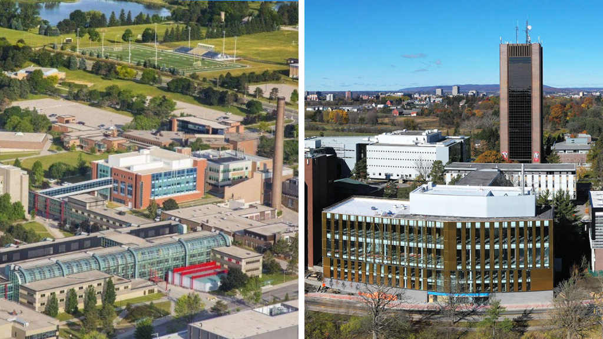

2025 Annual Summit on Neurosymbolic Adaptive Programming
========================================================

The ANIMUS lab and University of Waterloo collaborators are proud to announce the first Summit on Neurosymbolic Adaptive Programming (SNAP), to be held **August 11th-15th, 2025**, at the University of Waterloo. The week-long intensive research collaboration will focus on *vector-symbolic programming* and *neural adaptive control programs*. Vector-symbolic programming is a novel approach to neural networks where the latent states of the network can be treated as arbitrary programs and executed. Vector-symbolic changes the focus of neural computation from data points to sets and functions, expanding what neural networks can learn and do. The SNAP collaborators aim to explore a new frontier in neuro-symbolic computing and low-power robotics.

============
Participants
============

Supervisors
-----------

* **Michael Furlong** (University of Waterloo): Adjunct Assistant Professor - Systems Design Engineering, University of Waterloo
Affiliate Member - Centre for Theoretical Neuroscience
   
* *TENTATIVE* **Mary Alexandria Kelly** (Carleton University): Dr. Mary Kelly is the principal investigator of the ANIMUS lab and an Assistant Professor in the Department of Cognitive Science. She is a cognitive scientist with a background in machine learning, cognitive psychology, psycholinguistics, computational linguistics, and philosophy of mind. Her research has two goals: (1) to advance the scientific understanding of the basic cognitive functions that underpin human learning, knowledge, and language acquisition, and (2) to develop biologically-inspired machine learning systems capable of achieving expert performance on arbitrary tasks through learning.

Co-leads
--------

* **Maria Vorobeva** (Carleton University): Maria’s current work includes the origin of intelligence, how the earliest forms of intelligence emerged, and how organisms evolved to become more general, how embodiment can influence and simplify cognitive processing, and comparative models of skill acquisition in solving programming problems.

* **Eilene Tomkins-Flanagan** (Carleton University): Eilene is interested in the epistemology of cognitive models and the structure of mental representations. She has written about how theory can be validated in computational, psychological, and anatomical terms, and designed a programming language that will run on a brain, with the goal of discovering how representations of seemingly any structure can be learned. She is currently focused on extending her earlier work to make the semantics of a programming language learnable.

* **Spencer Eckler** (Carleton University): Spencer’s research is in causal reasoning – how we reason about actions, outcomes, and counterfactuals. He uses cognitive models to simulate psychological tasks tying behaviour, neural activity, and mental representations through theory synthesis.

* 

* **Connor Hanley** (Carleton University): Connor is interested in cognitive architectures, the theory and applications of neuromorphic computation, and biologically plausible models of representations of numerosity.

=========
Resources
=========

* `<https://github.com/eilene-ftf/holis>`_
